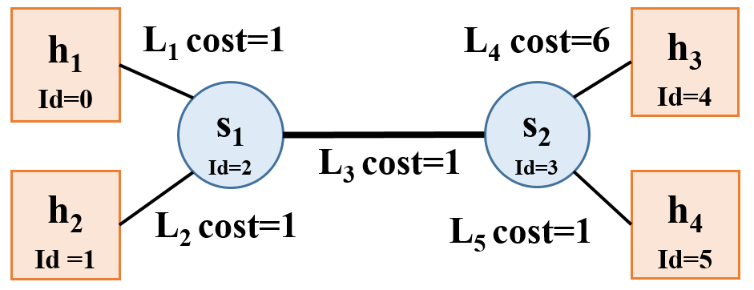

# Video Streaming via CDN

## Table of contents
* [Overview](#overview)
* [Part 1](#part1): Bitrate Adaptation in HTTP Proxy
* [Part 2](#part2): DNS Load Balancing

<a name="overview"></a>
## Overview

Video traffic dominates the Internet. In this project, we explore how video content distribution networks (CDNs) work. In particular, we implement adaptive bitrate selection, DNS load balancing, and an HTTP proxy server to stream video at high bit rates from the closest server to a given client.


### Video CDNs in the Real World
The figure above depicts a high level view of what this system looks like in the real world. Clients trying to stream a video first issue a DNS query to resolve the service's domain name to an IP address for one of the CDN's content servers. The CDN's authoritative DNS server selects the “best” content server for each particular client based on
(1) the client's IP address (from which it learns the client's geographic location) and
(2) current load on the content servers (which the servers periodically report to the DNS server).

Once the client has the IP address for one of the content servers, it begins requesting chunks of the video the user requested. The video is encoded at multiple bitrates; as the client player receives video data, it calculates the throughput of the transfer and requests the highest bitrate the connection can support.

### Video CDN in this Assignment
We focus on a simplified version. First, our system will run on one host and rely on mininet to run several processes with arbitrary IP addresses on one machine. Mininet allows us to assign arbitrary link characteristics (bandwidth and latency) to each pair of “end hosts” (processes).


**Browser.** We use an off-the-shelf web browser (Firefox) to play videos served by your CDN (via your proxy).

**Proxy.** Rather than modify the video player itself, We implement adaptive bitrate selection in an HTTP proxy. The player requests chunks with standard HTTP GET requests; our proxy intercept these and modify them to retrieve whichever bitrate our algorithm deems appropriate.

**Web Server.** Video content is served from an off-the-shelf web server (Apache). As with the proxy, we run multiple instances of Apache on different IP addresses to simulate a CDN with several content servers.

**DNS Server.** We implement a simple DNS that supports only a small portion of actual DNS's functionality. Our server will respond to each request with the “best” server for that particular client.

To summarize, this assignment has the following components:

* [Part 1](#part1): Bitrate Adaptation in HTTP Proxy
* [Part 2](#part2): DNS Load Balancing

<a name="environment"></a>

<a name="part1"></a>
## Part 1: Bitrate Adaptation in HTTP Proxy

Many video players monitor how quickly they receive data from the server and use this throughput value to request better or lower quality encodings of the video, aiming to stream the highest quality encoding that the connection can handle. Instead of modifying an existing video client to perform bitrate adaptation, we implement this functionality in an HTTP proxy through which your browser will direct requests.

The simple HTTP proxy, `miProxy`, accepts connections from web browsers, modifies video chunk requests as described below, resolves the web server's DNS name, opens a connection with the resulting IP address, and forwards the modified request to the server. Any data (the video chunks) returned by the server should be forwarded, *unmodified*, to the browser.

`miProxy` should listen for browser connections on `INADDR_ANY` on the port specified on the command line. It should then connect to a web server either specified on the command line or issue a DNS query to find out the IP address of the server to contact (this is covered in part 2).


`(assign ephemeral)` is referring to the fact that the kernel will pick the proxy's TCP port when it connects to the web server's port `80`. Nothing more than the proxy calling `connect()` is happening here.

`miProxy` should accept multiple concurrent connections from clients (Firefox web browser) using `select()` and be able to handle the required HTTP 1.1 requests for this assignment (e.g., HTTP `GET`).

The picture above shows `miProxy` connected to multiple web servers, which would be the case if `miProxy` issued a DNS request for each new client connection received (e.g each new connection from an instance of Firefox). This is one approach for utilizing the DNS `nameserver` you will write in part 2. Another approach would be to issue a DNS request **once** when `miProxy` starts up, and direct all client requests to one web server for the entire runtime of `miProxy`. Either approach is acceptable for grading purposes, but the former is preferred because it provides more efficient load balancing. The former approach is also closer to the behavior of an actual load balancing proxy.

We will cover the basic usage of `select()` in the discussion.

> *Note: A good resource for socket programming is [Beej's Guide to Network Programming Using Internet Sockets](https://beej.us/guide/bgnet/html/).*

### Throughput Calculation

Our proxy measure the the throughput between the server and itself to determine the bitrate. Our proxy should estimate each stream's throughput once per chunk. Note the start time of each chunk when our proxy started receiving the chunk from the server and save another timestamp when we have finished receiving the chunk from the server. Given the size of the chunk, we can now compute the throughput by dividing chunk size by time window.

Each video is a sequence of chunks. To smooth our throughput estimation, we should use an exponentially-weighted moving average (EWMA). Every time we make a new measurement (as outlined above), update our current throughput estimate as follows:

`T_cur = alpha * T_new + (1 - alpha) * T_cur`

The constant `0 ≤ alpha ≤ 1` controls the tradeoff between a smooth throughput estimate (`alpha` closer to 0) and one that reacts quickly to changes (`alpha` closer to 1). We will control `alpha` via a command line argument. When a new stream starts, set `T_cur` to the lowest available bitrate for that video.

### Choosing a Bitrate

Once our proxy has calculated the connection's current throughput, it should select the highest offered bitrate the connection can support. For this project, we say a connection can support a bitrate if the average throughput is at least 1.5 times the bitrate. For example, before our proxy should request chunks encoded at 1000 Kbps, its current throughput estimate should be at least 1.5 Mbps.

Our proxy should learn which bitrates are available for a given video by parsing the manifest file (the ".f4m" initially requested at the beginning of the stream). The manifest is encoded in XML; each encoding of the video is described by a `<media>` element, whose bitrate attribute you should find.

Our proxy replaces each chunk request with a request for the same chunk at the selected bitrate (in Kbps) by modifying the HTTP request’s `Request-URI`. Video chunk URIs are structured as follows:

`/path/to/video/<bitrate>Seg<num>-Frag<num>`

For example, suppose the player requests fragment 3 of chunk 2 of the video `big_buck_bunny.f4m` at 500 Kbps:

`/path/to/video/500Seg2-Frag3`

To switch to a higher bitrate, e.g., 1000 Kbps, the proxy should modify the URI like this:

`/path/to/video/1000Seg2-Frag3`

### Running `miProxy`
To operate `miProxy`, it should be invoked in one of two ways

**Method 1** - No DNS `nameserver` functionality, hard coded web server IP:

This mode of operation will be for testing your proxy without a working DNS server from part 2.

`./miProxy --nodns <listen-port> <www-ip> <alpha> <log>`

* `--nodns` This flag indicates the proxy won't use DNS to get the web server IP.
* `listen-port` The TCP port your proxy should listen on for accepting connections from your browser.
* `www-ip` Argument specifying the IP address of the web server from which the proxy should request video chunks. Again, this web server is reachable at port TCP port `80`.
* `alpha` A float in the range [0, 1]. Uses this as the coefficient in your EWMA throughput estimate.
* `log` The file path to which you should log the messages as described below.

**Method 2** - Full and final functionality (after part 2 is implemented):

In this mode of operation your proxy should obtain the web server's IP address by querying your DNS server for the name `video.cse.umich.edu`.

`./miProxy --dns <listen-port> <dns-ip> <dns-port> <alpha> <log>`

* `--dns` This flag indicates the proxy will use DNS to obtain the web server IP.
* `listen-port` The TCP port your proxy should listen on for accepting connections from your browser.
* `dns-ip` IP address of the DNS server.
* `dns-port` Port number DNS server listens on.
* `alpha` A float in the range [0, 1]. Uses this as the coefficient in your EWMA throughput estimate.
* `log` The file path to which you should log the messages as described below.

### miProxy Logging
`miProxy` must create a log of its activity in a very particular format. If the log file already exists, `miProxy` overwrites the log. *After each chunk-file response from the web server*, it should append the following line to the log:

`<browser-ip> <chunkname> <server-ip> <duration> <tput> <avg-tput> <bitrate>`

* `broswer-ip` IP address of the browser issuing the request to the proxy.
* `chunkname` The name of the file your proxy requested from the web server (that is, the modified file name in the modified HTTP GET message).
* `server-ip` The IP address of the server to which the proxy forwarded this request.
* `duration` A floating point number representing the number of seconds it took to download this chunk from the web server to the proxy.
* `tput` The throughput you measured for the current chunk in Kbps.
* `avg-tput` Your current EWMA throughput estimate in Kbps.
* `bitrate` The bitrate your proxy requested for this chunk in Kbps.

<a name="part2"></a>
## Part 2: DNS Load Balancing

To spread the load of serving videos among a group of servers, most CDNs perform some kind of load balancing. A common technique is to configure the CDN's authoritative DNS server to resolve a single domain name to one out of a set of IP addresses belonging to replicated content servers. The DNS server can use various strategies to spread the load, e.g., round-robin, shortest geographic distance, or current server load (which requires servers to periodically report their statuses to the DNS server). 

In this part, we write a simple DNS server that implements load balancing in two different ways: round-robin and geographic distance. 

### Message Format for Our DNS Implemetation
In order for our proxy to be able to query our DNS server, we write an accompanying DNS resolution library.

* `AA` Set this to 0 in requests, 1 in responses.

* `RD` Set this to 0 in all messages.

* `RA` Set this to 0 in all messages.

* `Z` Set this to 0 in all messages.

* `NSCOUNT` Set this to 0 in all messages.

* `ARCOUNT` Set this to 0 in all messages.

* `QTYPE` Set this to 1 in all requests (asking for an A record).

* `QCLASS` Set this to 1 in all requests (asking for an IP address).

* `TYPE` Set this to 1 in all responses (returning an A record).

* `CLASS` Set this to 1 in all responses (returning an IP address).

* `TTL` Set this to 0 in all responses (no caching).

**There are some slight nuances in the format of our DNS messages**. The main difference between what we do and what the RFC specifies is that the response should contain header + question + record, whereas our response is only header + record. Also, the size of each **encoded** object (represented as a 4-byte integer) is sent before sending the contents of the object. The overall procedure is outlined below:

1. `miProxy` sends integer designating the size of DNS header -> `miProxy` sends DNS header via encode() -> `miProxy` sends integer designating the size of DNS Question -> `miProxy` sends DNS Question via encode()

2. `nameserver` recvs() integer designating size of DNS Header -> `nameserver` recvs() DNS header via decode() -> `nameserver` recvs() integer designating size of DNS Question -> `nameserver` recvs() DNS Question via decode()

3. `nameserver` sends integer designating size of DNS Header -> `nameserver` sends DNS Header via encode() -> `nameserver` sends integer designating size of DNS Record -> `nameserver` sends DNS Record via encode()

4. `miProxy` recvs() integer designating size of DNS Header -> `miProxy` recvs() DNS header via decode() -> `miProxy` recvs() integer designating size of DNS Record -> `miProxy` recvs() DNS Record via decode()

**Remember to use `htonl` and `ntohl` when sending/receiving integers over the network!**

### Round-Robin Load Balancer
One of the ways we implement `nameserver` is as a simple round-robin based DNS load balancer. It takes as input a list of video server IP addresses on the command line; it responds to each request to resolve the name `video.cse.umich.edu` by returning the next IP address in the list, cycling back to the beginning when the list is exhausted.

`nameserver` will bind to an IP address and port specified as command line arguments. It responds **only** to requests for `video.cse.umich.edu`; any other requests should generate a response with `RCODE` 3.

Example text file format in `sample_round_robin.txt`:
```
10.0.0.1
10.0.0.2
10.0.0.3
```

### Geographic Distance Load Balancer
Next we make your DNS server somewhat more sophisticated. Our load balancer must return the closest video server to the client based on the proxy’s IP address. In the real world, this would be done by querying a database mapping IP prefixes to geographic locations. For our implementation, however, we will be given information in a text file about the entire state of the network, and our server will have to return to a given client its closest geographic server.

The text file will be represented in the following way:
```
NUM_NODES: <number of hosts and switches in the network>
<host_id> <CLIENT|SWITCH|SERVER> <IP address|NO_IP>
(repeats NUM_NODES - 1 times)
NUM_LINKS: <number of links in the network>
<origin_id> <destination_id> <cost>
(repeats NUM_LINKS - 1 times)
```



As an example, the network shown above will have the following text file, `sample_geography.txt`:
```
NUM_NODES: 6
0 CLIENT 10.0.0.1
1 CLIENT 10.0.0.2
2 SWITCH NO_IP
3 SWITCH NO_IP
4 SERVER 10.0.0.3
5 SERVER 10.0.0.4
NUM_LINKS: 5
0 2 1
1 2 1
2 3 1
3 4 6
3 5 1
```

To operate `nameserver`, it should be invoked as follows:

`./nameserver [--geo|--rr] <port> <servers> <log>`

* `--geo` This flag specifies that `nameserver` will operate in the geography/distance based load balancing scheme.
* `--rr` This flag specifies that `nameserver` will operate in the round-robin based load balancing scheme.
* `port` The port on which your server should listen.
* `servers` A text file containing a list of IP addresses, one per line, belonging to content servers if `--rr` is specified. Otherwise, if `--geo` is specified, it will be a text file describing the network topology as explained above.
* `log` The file path to which you should log the messages as described below.

**Exactly one of `--rr` or `--geo` will be specified.**

> *Note: for simplicity, arguments will appear exactly as shown above (for both modes) during testing and grading. Error handling with the arguments is not explicitly tested but is highly recommended. At least printing the correct usage if something went wrong is worthwhile.*

### nameserver Logging
Our DNS server must log its activity in a specific format. If the log specified by the user already exists, our DNS server overwrites the log. *After each* valid DNS query it services, it should append the following line to the log:

`<client-ip> <query-name> <response-ip>`

* `client-ip` The IP address of the client who sent the query.
* `query-name` The hostname the client is trying to resolve.
* `response-ip` The IP address you return in response.

### queryDNS utility

 `queryDNS` (in the starter_code directory) sends a DNS query to `nameserver` (just like a `miProxy` does), and outputs the reponse from DNS server. 

 The command line to use `queryDNS` is:
 ```
<path to the binary>/queryDNS <IP of nameserver> <port of nameserver>
 ```

 If everything goes well, you should get responses like `10.0.0.1`, `10.0.0.2` and `10.0.0.3`.
